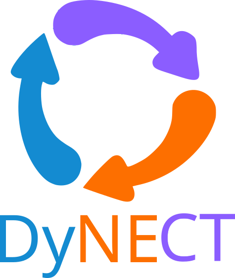

<p align="center">
  
</p>

[](https://github.com/bemilio/DyNECT/blob/main/LICENSE)  


**DyNECT** stands for _Dynamic Nash Equilibrium Control Toolbox_ - a Julia package for modeling and solving constrained dynamic Nash equilibrium control problems  

A **linear quadratic (LQ) game** is a multi-agent control problem, where each decision maker influences the evolution of the shared linear dynamical system  
```math
x^{k+1} = A x^k + \sum_{i=1}^N \left(B_i u^k_i\right) + c,
```
and optimizes a quadratic performance metric
```math
J_i(u_i, u_{-i}) =  \frac{1}{2} (x^T)^\top P_i x^T + \sum_{k=0}^{T-1}
\left(\frac{1}{2}(x^k)^\top Q_i x^k 
+ \frac{1}{2}(u_{j}^k)^\top R_{i} u_{i}^k \right),
```
where $P_i, Q_i,, R_{i}$ are the weights of the optimization problem for agent $i$, and $u_{-i}$ is the collection of inputs that belong to agents _other_ than $i$, namely, $u_{-i}=(u_j)_{j\neq i}$.  
**DyNECT** helps you find the open-loop Nash equilibrium of the game, that is, the input sequences $`(u_1^*,..., u_N^*)`$ such that
```math
J_i(u^*_i, u^*_{-i}) \in \arg\min_{u_i} J_i(u_i, u^*_{-i}).
```

**DyNECT** supports state constraints, local input constraints and shared input constraints of the kind


$$`\begin{aligned}
C^{\text x} x^k &\leq b^{\text x}\\
C^{\text{loc}}_i u_i^k &\leq b^{\text{loc}}_i \quad \forall i\\
\sum_i C^{\text u} u_i^k &\leq b^{\text u}.
\end{aligned}`$$

Many functionalities of DyNECT are based on reformulating the dynamic game into the affine variational inequality (AVI)
```math
\text{find}~ u^*~ \text{such that} ~~~\mathcal F(u^*)^\top (u-u^*) \geq 0, \qquad \forall ~ u\in \mathcal C,
```

where $\mathcal F$ is  a linear mapping parametric in the initial state of the system $x^0$ of the kind
```math
\mathcal F: ~u \to Hu + Fx^0 + f
```
and $\mathcal C$ is a polyhedron of the kind
```math
\mathcal{C} = \{Au \leq Bx^0 + b\}. 
```
You can find more details on the problem formulation, and on the LQ game-to-VI conversion, as well as a performance comparison between some implemented solution algorithms, on our paper

[_The explicit game-theoretic linear quadratic
regulator for constrained multi-agent systems_ E. Benenati, G. Belgioioso, 2025](https://arxiv.org/pdf/2512.07749)


## Features

- Collection of state-of-the-art iterative and explicit solvers for open-loop dynamic games  
- Utility tools for streamlined implementation of game-theoretic MPC
- Automatic reformulation of LQ games as (multi-parametric) Variational Inequalities (VIs)
- Solution of coupled Riccati equations arising in unconstrained infinite-horizon games  
- Integration with [Monviso](https://github.com/nicomignoni/Monviso.jl) for access to multiple VI solution algorithms
- Integration with [pDAQP](https://github.com/darnstrom/ParametricDAQP.jl/pull/19) for offline precomputation of state-to-solution map, enabling fast online control
- Unified solver access through the  [CommonSolve.jl](https://github.com/SciML/CommonSolve.jl) interface

## Installation

DyNECT depends on a development fork of 'ParametricDAQP.jl'. From the Julia REPL:

```sh
] add https://github.com/bemilio/ParametricDAQP.jl#mpVI
] add https://github.com/bemilio/DyNECT.git
```

## Examples

The example in `examples/solve_LQGame_as_VI.jl`:
- Implements a basic LQ game
- Converts it into a multi-parametric VI
- Finds explicitely the explicit solution mapping for all initial states
- Given an initial state, converts the multi-parametric VI into a VI
- Solves the VI via several iterative algorithms

Additional examples can be found at [this link](https://github.com/bemilio/scripts_for_explicit_LQGames_paper). 


